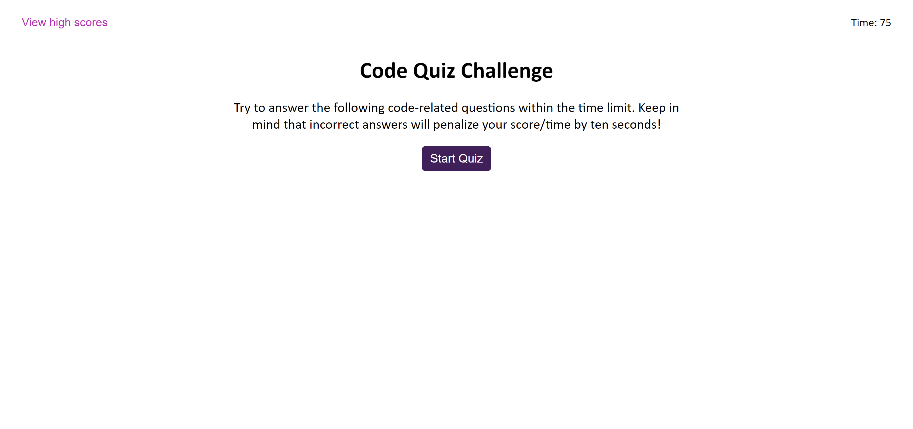

# Code Quiz
A timed quiz on the fundamentals of Javascript that saves high scores.

https://kg-phantom.github.io/code-quiz/

## Timer
When the user clicks the start button, a timer starts and the first question is presented.
- If the user answers correctly, the next question is presented.
- If the user answers incorrectly, time is subtracted from the clock, the user is notified that they answered incorrectly, and then the next question is presented.

When all the questions have been answered or the timer reaches 0, the game is over.

## High Score
Once the game has ended, the user can save their initals and score.

Previous scores can be viewed by clicking on the "View High Scores" button.